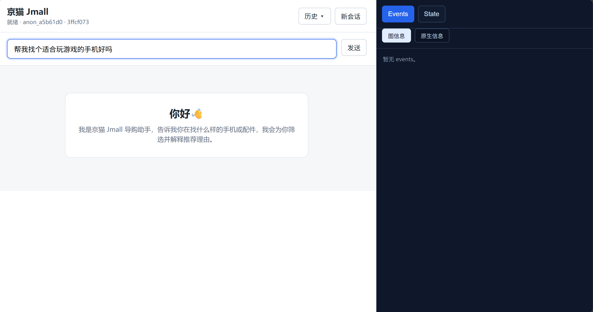
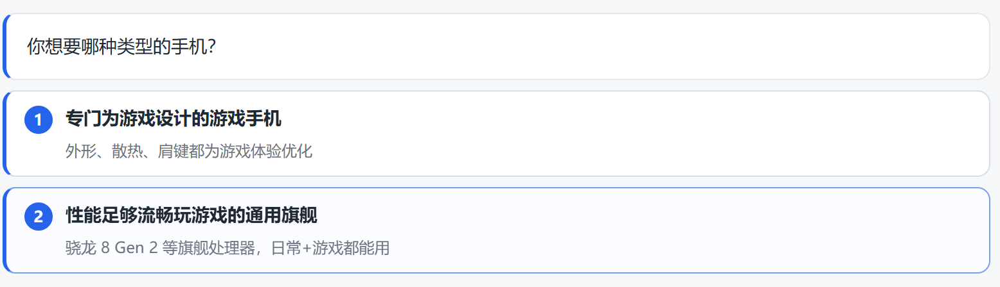
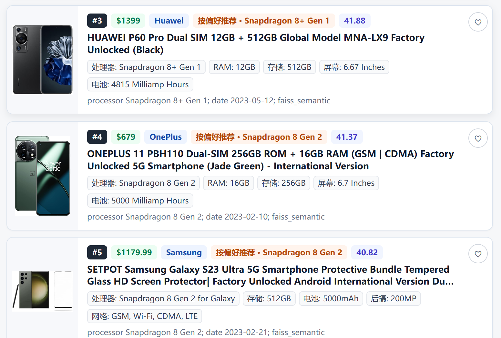
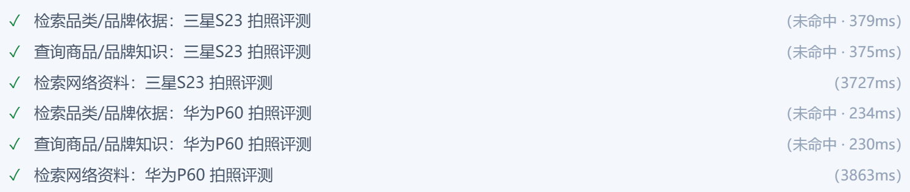
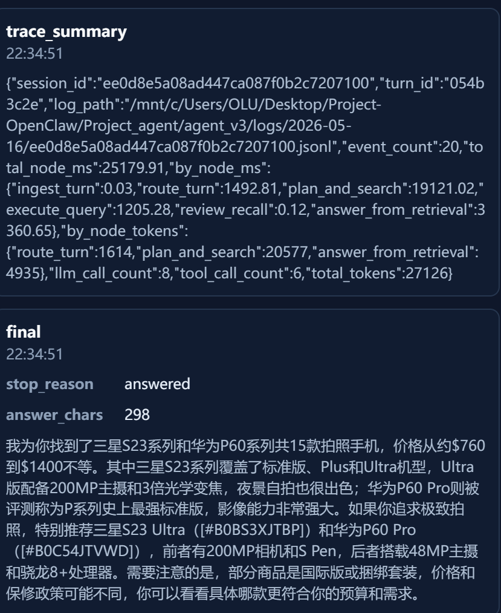

# 京猫 Jmall · Agent V3

> 基于 LangGraph + DeepSeek V4 的电商导购 Agent。一类目一份 schema 驱动的查询规划、BM25 + FAISS 混合检索、SSE 流式回答 + 商品瀑布流前端。



## 演示

| 流程 | 截图 |
|---|---|
| 用户输入需求 → 路由澄清（带 2–4 个选项按钮） |  |
| 确认意图后 → schema-driven plan + 混合检索 → 商品瀑布流 |  |
| 工具调用状态行 + 信源 popover |  |
| 右侧调试面板：Events / State 双 tab + 图信息/原生信息切换 |  |

---

## 项目定位

这是一个**可调试的电商导购 Agent**：用户用自然语言（中文为主，含黑话/昵称/错别字/型号别名等）描述需求，Agent 通过路由 → 澄清 → 查询规划 → 检索 → 复核 → 回答这条 6 节点流水线，给出搜索框下方的对话气泡 + 商品瀑布流。

数据来源是 **Amazon Reviews 2023** 公开数据，经清洗后包含 13.6k 部手机整机 + 配件，目录共 2 个商品类目（`cell_phone` / `accessories`）。

V3 是从零重写的版本，相比 V1（规则系统）/ V2（自研框架 + 多工具），核心差异是：

- **节点小而显式**：单一职责、明确读写契约，每个节点都可以单跑调试。
- **schema 驱动 plan**：每个类目一份 schema（enum/range/freetext + alias_map + tier_groups + soft_buckets），LLM 一步从 user_input 生成查询计划，没有中间 `shopping_context.targets` 层。
- **硬 enum + 代码后处理 alias**：alias 翻译（"骁龙8 Gen 2" → `Snapdragon 8 Gen 2`、"苹果" → `Apple`）由 `normalize_alias` 在 LLM 输出后做，**不写进 prompt**。
- **messages 单一通道**：用户输入、点选项、跨轮上下文，全部从 messages 读，不造 agent_context 平行字段。
- **真正流式**：路由节点 JSON 边输出边给前端渲染澄清问题 + 选项；回答节点 token 级 SSE 推送；工具调用按白名单出 "正在查 X" 状态行。

---

## Graph 拓扑

```text
START
  │
  ▼
ingest_turn ──────────────────────────────────────────── finish (no-clarify-needed shortcut)
  │
  ▼
route_turn ─┬─ knowledge_clarify ─────────┐
            │                              │
            ├─ product_support_lookup ──── answer_from_support ──┐
            │                              │                      │
            ├─ plan_and_search ──── execute_query ── review_recall ─┬─ answer_from_retrieval ──┐
            │                                  ▲                    │                          │
            │                                  └────────────────────┘ (retry, ≤ 1 次)          │
            │                                                                                    │
            └─ {clarify_user, answer_only} ──────────────────────────────────────────────────── finish
```

路由 5 种 action：

| action | 含义 |
|---|---|
| `clarify_user` | 当前信息不足，需要追问（可带 2–4 个选项按钮） |
| `knowledge_clarify` | 用户表达里有昵称/黑话/错别字/术语，先查知识库澄清 |
| `ready_for_search` | 意图清楚，直接进 `plan_and_search` |
| `product_support_lookup` | 用户在追问当前瀑布流里某件商品的详情/评论/真假/售后 |
| `answer_only` | 非购物对话（感谢、闲聊、能力咨询） |

---

## 核心设计：Schema 驱动的查询规划

### 一类目一份 schema

`query_schemas.py` 里每个类目是一份独立 dict，结构：

```python
{
  "category": "cell_phone",
  "fields": {
    "brand":     {"type": "enum",  "values": [...], "tier_groups": {"general_flagship": [...], "gaming_dedicated": [...]}},
    "processor": {"type": "enum",  "values": [...], "tier_groups": {"flagship_2023": [...], "mid_2023": [...]}},
    "battery_mah":      {"type": "range", "min": 1000, "max": 10000, "unit": "mAh"},
    "screen_refresh_hz":{"type": "range", "min": 60,   "max": 165,   "unit": "Hz"},
    "series":    {"type": "freetext"},
    "budget":    {"type": "range", "min": 0, "max": 50000, "unit": "RMB"},
    ...
  },
  "soft_buckets": {
    "must_have":    "schema 字段不能表达的必要约束（OS 版本、礼盒装、海外版等）",
    "nice_to_have": "schema 字段不能表达的软偏好（颜色、外观、手感、送礼场景）",
    "avoid":        "schema 字段不能表达的排除项",
  },
  "alias_map": {
    "brand":     {"苹果": "Apple", "iphone": "Apple", "华子": "Huawei", ...},
    "processor": {"骁龙8 Gen 2": "Snapdragon 8 Gen 2", "SD8G2": "Snapdragon 8 Gen 2", ...},
    ...
  },
}
```

### LLM 看到的 vs 代码处理的

- `llm_visible_schema(cat)`：剥掉 `alias_map` 之后的 schema 视图，喂给 LLM。
- `normalize_alias / coerce_enum_values / coerce_range_value`：LLM 输出后由代码做归一化和合法性校验，非法值 silent drop。

这种"硬 enum + 代码后处理"是 V3 的核心取舍：**alias 表不进 prompt**，LLM 看到的字段简洁、值闭集，写错也会被丢弃，避免 prompt 屎山。

### 三档语义

每条 query plan 的 `lexical_query` 只有三档：

- **must**：用户本轮表达的所有 spec 约束，全部硬过滤。
- **must_not**：明确排除（默认追加 `condition=[翻新机, 二手机]`）。
- **soft**：schema 表达不了的自由文本（颜色、外观、礼盒装等），仅参与语义召回排序，不做硬过滤。

档位词（"旗舰/中端/入门/游戏专精"等）必须用 `{"tier": "<name>"}` 形态写进 must / must_not，由 `expand_tier()` 解析成具体 enum 值列表，避免 LLM 自己列芯片名。

### 新加一个类目

只需要在 `query_schemas.py` 里加一份新 schema dict + 在 `CATEGORY_SCHEMAS` 注册——graph / 节点代码不动。

---

## State 顶层（13 字段）

```python
class ShoppingState(TypedDict, total=False):
    user_id: str
    session_id: str
    messages: Annotated[list[Any], add_messages]   # 唯一的对话历史通道
    knowledge_memory: dict[str, KnowledgeMemoryItem]  # append-only（key 含 ts + uuid）
    knowledge_context: KnowledgeContext
    categories: list[str]                          # router 跨轮维护的活跃类目
    current_retrieval: RetrievalRecord             # 单一滚动检索记录，无 history 列表
    interested_products: list[InterestedProduct]   # 用户加心愿的商品（≤20，最近优先）
    agent_context: AgentContext                    # 5 字段 per-turn scratch
    needs_clarification: bool
    next_action: NextAction
    final_answer: str
    errors: list[str]
```

设计要点：
- **messages 是唯一持久化通道**：clarify 选项点击后变成普通 user message，没有任何平行 side-channel。
- **categories 跨轮持久**：router 每轮可 add/remove/replace，系统从不自动清。
- **current_retrieval 单一滚动**：瀑布流不删，新 query 时整体刷新，不维护 `retrieval_history`。
- **knowledge_memory append-only**：用 `make_knowledge_memory_key(query)` 生成 `query@timestamp#uuid` 复合 key，避免不同时间查同一 query 互相覆盖。

---

## 检索栈

- **数据源**：Amazon Reviews 2023 公开数据，清洗后 `processed/v3/idx_cell_phone.jsonl`（13,628 部手机整机）。
- **BM25**：SQLite FTS5（`processed/v3/bm25/cell_phone.sqlite`），按 schema 字段建索引（brand/model/series/processor/ram/rom/storage/camera/battery/charging/screen/network/os/weight/color/condition/title/all_text）。
- **FAISS**：BAAI/bge-m3 句向量 + 本地 hash embedding fallback（`processed/v3/faiss/cell_phone.index`）。
- **混合召回**：BM25 + FAISS 双路并行 → 字段命中评分 + 时间近度（`RECENCY_REFERENCE_DATE = 2024-01-01`）+ category/budget 过滤 → `diversity_rerank` 做品牌多样性扣分 → 合并瀑布流（cache 100 条，超出走 live 重取）。
- **本地知识库**：`data/knowledge/*.jsonl`（品牌别名、类目别称、技术术语、型号系列、评测事实、信源），关键词匹配 + 子串扫描 + token 重叠 fallback，命中率不足时由 `web_lookup` 兜底（DeepSeek JSON chat）。

---

## 模型分工

| 节点 | 模型 | 环境变量 |
|---|---|---|
| `route_turn` | `deepseek-v4-flash` | `DEEPSEEK_ROUTER_MODEL` |
| `knowledge_clarify` | `deepseek-v4-flash` | `DEEPSEEK_KNOWLEDGE_MODEL` |
| `plan_and_search` | `deepseek-v4-pro` | `DEEPSEEK_PLAN_MODEL` |
| `product_support_lookup` | `deepseek-v4-flash` | `DEEPSEEK_PRODUCT_SUPPORT_MODEL` |
| `answer_from_retrieval` / `answer_from_support` | `deepseek-v4-flash` | `DEEPSEEK_ANSWER_MODEL` |
| query_support 摘要子代理 | `deepseek-v4-flash` | `DEEPSEEK_QUERY_SUPPORT_SUMMARY_MODEL` |

`plan_and_search` 是 V3 里最重的节点——LLM 直接从 user_input → query plan，并自带 ≤5 次 `lookup_query_support` 工具循环（native tool_calls 优先，text fallback 兜底）——因此用 `deepseek-v4-pro`，其余流程节点全部 flash。

LLM 超时：connect 10s / read 25s / total 90s（`llm_client.py`），SSE 流式 chunk 间隔保守上限 25s，避免单点 LLM 挂死拖死整个会话。

---

## 执行上限

`planning_limits.py`：

```python
MAX_CLARIFY_ROUNDS = 2            # 单次会话最多澄清 2 轮，再多直接强行 ready_for_search
MAX_PLANS_PER_TURN = 4            # plan_and_search 单轮最多产 4 条 query plan
MAX_RECALL_REVIEW_ITERATIONS = 1  # review_recall 不达标最多重试 1 次
```

`plan_and_search` 内部：`MAX_QUERY_SUPPORT_LOOKUPS = 5`。

---

## 前端

`static/` 是京猫 Jmall 单页：

- 搜索框下方的对话气泡 + 商品瀑布流（无限下拉）。
- SSE 事件：`session / start / answer_token / router_question / router_option / tool_started / tool_finished / graph_update / debug_metrics / trace_summary / final / error`。
- 调试面板（右侧）双 tab：Events / State，再有 "图信息 / 原生信息" 两种视图。
- 静态资源 cache-bust 用 `?v=YYYYMMDD_xxx` query。

---

## 项目结构

```
agent_v3/
├── graph.py                 # LangGraph 拓扑
├── state.py                 # ShoppingState 及子结构 TypedDict
├── runtime.py               # GraphRuntime：run_turn / stream_turn（worker 线程 + ContextVar 流式）
├── runtime_store.py         # 会话状态持久化（SQLite）
├── server.py                # FastAPI / SSE / 商品瀑布流分页
├── cli.py                   # 命令行入口
├── query_schemas.py         # 一类目一份 schema + helpers（normalize_alias / coerce_*）
├── planning_limits.py       # 三档执行上限常量
├── llm_client.py            # DeepSeek OpenAI 兼容客户端（含流式 / 工具循环 / usage 记录）
├── llm_debug.py             # token usage 归一化与累加
├── streaming.py             # ANSWER_TOKEN_SINK / ROUTER_STREAM_SINK / TOOL_STREAM_SINK
├── streaming_json.py        # 路由节点 JSON 边输出边切片 question / option
├── tracing.py               # 每轮 turn_id + 节点 scope + LLM/Tool 调用记录
├── embeddings.py            # bge-m3 / 本地 hash embedding 共享层
│
├── nodes/                   # 7 个图节点
│   ├── ingest_turn.py
│   ├── route_turn.py
│   ├── knowledge_clarify.py
│   ├── plan_and_search.py   # V3 核心：user_input → query plans，含 lookup 工具循环
│   ├── execute_query.py     # 多 plan 并行召回 → 瀑布流合并 → 多样性 rerank
│   ├── review_recall.py     # 规则检查 top-K 是否满足 must/must_not，不达标 retry
│   ├── answer_from_retrieval.py
│   ├── product_support_lookup.py
│   ├── answer_from_support.py
│   ├── web_lookup.py        # 本地知识库 miss 时的 DeepSeek 兜底
│   ├── load_user_memory.py  # 已 detach（memory loop 暂停）
│   └── update_user_memory.py
│
├── tools/
│   ├── search_catalog.py    # BM25 + FAISS 商品检索 + 字段评分 + recency 加权
│   ├── lookup_knowledge.py  # 本地 JSONL 知识库（多策略匹配 + BM25 + FAISS 可选）
│   ├── retrieve_knowledge_support.py
│   └── diversity_rerank.py  # 品牌多样性扣分
│
├── memory/                  # 长期用户记忆模块（保留代码，loop 未挂入 graph）
│   ├── store.py             # SQLite 持久化
│   ├── profile.py           # 偏好画像
│   ├── events.py            # 行为事件
│   ├── recall.py            # 召回 + 注入 prompt
│   ├── judge.py             # LLM 判官接收/拒绝事件
│   ├── cooccurrence.py      # 共现统计
│   ├── inject.py            # 注入入口
│   └── schemas.py
│
├── data/
│   ├── knowledge/           # 知识库 JSONL（aliases/categories/tech_terms/models/review_facts/sources）
│   ├── knowledge_bases/
│   └── memory.sqlite        # 长期记忆（运行时生成）
│
├── static/                  # 京猫 Jmall 前端（index.html + styles.css + app.js）
├── tests/                   # live 烟雾测试脚本（DeepSeek 真调用）
├── evals/                   # knowledge_rag_cases / memory_cases JSONL
├── tasks/                   # 历次设计 + 落地记录
│
├── DESIGN_SCHEMA_DRIVEN_PLANNING.md
├── DEFERRED_FEATURES.md
└── V3_MEMORY.md
```

数据/索引资源（不在本目录、不入 git）：

```
processed/v3/
├── idx_cell_phone.jsonl           # 清洗后的商品 catalog
├── stats_v3.json
├── bm25/cell_phone.sqlite         # 商品 BM25 索引（FTS5）
├── faiss/cell_phone.index         # 商品 FAISS 索引（bge-m3）
├── faiss/cell_phone.meta.jsonl
├── faiss/cell_phone.manifest.json
├── knowledge_bm25/                # 知识库 BM25
└── knowledge_faiss/               # 知识库 FAISS
```

---

## 推荐仓库布局

`agent_v3` 是一个 Python 包，import 路径 `from agent_v3.xxx import ...`，放在仓库根的子目录里：

```
jmall-agent/
├── README.md
├── LICENSE                  ← MIT
├── .env.example
├── .gitignore
├── requirements.txt
├── agent_v3/                ← Python 包
│   ├── server.py
│   ├── runtime.py
│   ├── graph.py
│   ├── ...
│   └── data/knowledge/      ← 知识库种子（JSONL，已入 git）
└── processed/               ← gitignored, 本地重建（见下方"数据重建"）
    └── v3/
        ├── idx_cell_phone.jsonl
        ├── bm25/cell_phone.sqlite
        └── faiss/cell_phone.{index,meta.jsonl,manifest.json}
```

> 代码里的路径用 `Path(__file__).resolve().parents[2]` 找仓库根，`Path(__file__).resolve().parents[1]` 找 `.env`，所以包目录必须叫 `agent_v3` 且位于仓库根的一级子目录。

---

## 快速开始

### 环境

- Python 3.10+
- DeepSeek API key（OpenAI SDK 兼容协议）
- 可选：CUDA / Apple MPS 用于 bge-m3 句向量索引（无 GPU 也能跑，会回退到本地 hash embedding）

### 安装依赖

```bash
pip install -r requirements.txt
```

### 环境变量

复制 `.env.example` 成仓库根目录的 `.env` 并填入 key：

```bash
cp .env.example .env
# 然后编辑 .env, 填入 DEEPSEEK_API_KEY
```

`.env` 已经在 `.gitignore` 里，不会进 git。

### 数据重建

`processed/` 不入 git，第一次跑前需要本地构建商品 catalog + 索引。流程：

1. 从 [Amazon Reviews 2023](https://amazon-reviews-2023.github.io/) 下载 `Cell_Phones_and_Accessories` 的 raw `meta` 文件（gzip JSONL）。
2. 用本仓库历史里的清洗脚本（`scripts/clean_v3.py`，本仓库未公开数据处理代码时请参考 `V3_MEMORY.md` 中的描述）产出 `processed/v3/idx_cell_phone.jsonl`（≈13.6k 条手机记录，含 specs 提取、image url、rag_texts）。
3. 构建 BM25 索引：参考 `tools/search_catalog.py` 中读取的 FTS5 表结构，按 schema 字段建表。
4. 构建 FAISS 索引（可选）：bge-m3 embedding，本地无 GPU 时可跳过——`search_catalog` 检测不到 manifest 会自动只走 BM25 + 本地 hash embedding。

> 如果你只想看 graph 运行流程，可以跳过 step 1–4：catalog 不存在时 `search_catalog` 会返回空列表，前端瀑布流为空，但路由/澄清/工具/答案生成节点全部能正常跑。

### 启动 Web 服务

```bash
uvicorn agent_v3.server:app --host 0.0.0.0 --port 8000 --reload
```

访问 `http://localhost:8000`，京猫 Jmall 单页应用。

### 命令行模式

```bash
python -m agent_v3.cli
```

### 程序化调用

```python
from agent_v3.runtime import GraphRuntime

runtime = GraphRuntime()
result = runtime.run_turn("帮我看看 3000-4500 拍照不错的安卓旗舰")
print(result.output_text)
print(result.state["current_retrieval"]["merged_stream"][:3])
```

---

## 设计原则（V3 内部约束）

落地过程中反复强调，新加机制前先对一遍：

1. **不叠屎山**：LLM 行为不对时，先改数据路径 / 加代码层确定性消费 / 升级模型，不往 prompt 里加规则。
2. **messages 是单一持久化通道**：跨节点信息中转优先走 messages，不造平行字段。
3. **硬 enum + 代码后处理 alias**：alias 表绝不进 prompt。
4. **不留中间状态层**：没有第二个 LLM 节点读的"中间表示"一律删除——`plan_and_search` 直接产最终 plan。
5. **不留死代码**：废弃节点 = 文件删除；废弃字段 = TypedDict 删条目；废弃中间态 = state 字段删除。
6. **模型不够换更强**：节点 prompt 接近 200 行或 LLM 漏写时优先升级 / 拆节点，不靠加 prompt 规则压住。
7. **少样本 ≤1 anchor**：路由 prompt 只保留游戏手机一例做 anchor，其它类目按抽象判据泛化。
8. **将就用，跑起来再改**：catalog 是 Amazon 2023 死数据，不为假想边界提前加分支。

---

## 暂停 / 延后的工作

参考 `DEFERRED_FEATURES.md`：

- **长期用户记忆 loop**：`memory/` 模块代码完整保留（SQLite + 行为事件 + 偏好画像 + 共现 + LLM 判官），但 `load_user_memory` / `update_user_memory` 节点未挂入 graph。重启 = `graph.py` 加回 import + 边 + 在节点恢复 `memory_context_for_prompt(state)` 调用。
- **更严格的本地知识库可信度判定**：`source_quality / confidence / source_ids / ttl_days` 已落地存储，但 runtime 还没基于这些字段做可靠性决策。
- **TTL 校验**：时间敏感记录的 ttl_days 字段还没在召回端真做校验。
- **Web lookup 信源回填**：`web_lookup` 输出还不强制带 URL / citation，回写本地知识库的 review 流程未建。
- **品牌歧义**："粗粮"在食品上下文 vs 手机上下文的二义未处理。

---

## 致谢与参考

- **LangGraph**：节点 + 边 + 状态图的拓扑抽象。
- **DeepSeek V4**：路由 / 规划 / 回答全链路。
- **BAAI/bge-m3**：商品 + 知识 FAISS 索引。
- **Amazon Reviews 2023**：商品 catalog 数据源（公开数据）。
- 知识库素材来源于公开评测、媒体横评、官方规格页等，详见 `data/knowledge/sources.jsonl`。

---

## License

MIT — 详见 [LICENSE](LICENSE)。
